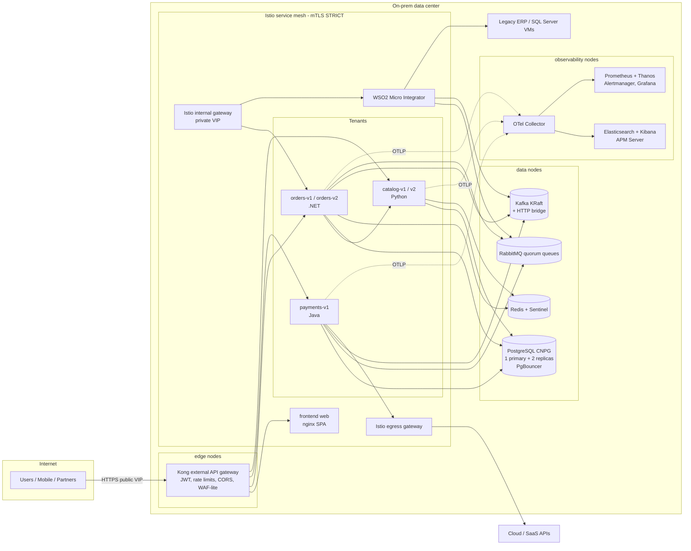

# Architecture

An on-prem, GitOps-managed MicroK8s platform for hosting .NET, Java and Python microservices and
static frontends for ~1,000,000 users, with multi-tenancy, multiple live versions per service,
canary delivery, and a full observability stack.

## High-level view



## Layers

| Layer | Technology | Why |
|-------|-----------|-----|
| Provisioning | Ansible (`ansible/`) | Repeatable bare-metal/VM setup, OS tuning, MicroK8s HA, Argo CD bootstrap, ConfigMap generation |
| Kubernetes | MicroK8s HA (dqlite, Calico) | Lightweight, snap-managed, on-prem friendly, HA with 3+ voters |
| Load balancing | MetalLB (`public-pool`, `internal-pool`) | Bare-metal `LoadBalancer` services |
| Storage | Longhorn (`longhorn`, `longhorn-db`) | Replicated block storage; `longhorn-db` for self-replicating data systems |
| GitOps | Argo CD (HA) app-of-apps + ApplicationSets | Everything declared in Git; tenants and versions generated from files |
| Progressive delivery | Argo Rollouts + Istio weighted routing + Prometheus analysis | Automated canary with rollback |
| External gateway | Kong (DB-less) | Public API edge: JWT, per-tenant rate limiting (Redis-backed), CORS, correlation IDs, OTel |
| Internal gateway | Istio internal ingress gateway | Private VIP for internal consumers, hybrid sites, ops UIs |
| Service mesh | Istio | mTLS, retries, timeouts, circuit breaking, outlier detection, authz, egress control |
| Hybrid | Istio ServiceEntry / WorkloadEntry / egress gateway, Kafka external listener, WSO2 MI | Integrate VMs, legacy systems and cloud services |
| Identity | Keycloak (realm per tenant) | OIDC for users, ops tools and Kong JWT validation |
| Secrets | Vault (raft HA) + External Secrets Operator | No secrets in Git |
| Certificates | cert-manager (`internal-ca`, `letsencrypt-prod`) | Automated TLS |
| Policy | Kyverno | Guardrails: registries, probes, limits, non-root, signatures |
| Registry | Harbor + Trivy | On-prem images, vulnerability scanning, replication |
| Autoscaling | HPA, KEDA (RabbitMQ/Kafka/Prometheus triggers) | Scale on CPU or on queue depth / lag |
| SQL | PostgreSQL via CloudNativePG (+ optional SQL Server) | HA, sync replication, PITR backups, PgBouncer pooling |
| Cache | Redis replication + Sentinel | Cache-aside, sessions, Kong rate-limit counters |
| Messaging | RabbitMQ (quorum queues) | Commands / work queues with DLQ |
| Streaming | Kafka (Strimzi, KRaft) + HTTP bridge + MirrorMaker2 | Event streaming, Kafka-compatible endpoints, cross-site replication |
| Integration | WSO2 Micro Integrator | REST↔SOAP mediation, legacy/ESB-style integration |
| Metrics | Prometheus, Thanos, Alertmanager, Grafana, blackbox exporter | Live monitoring, long-term metrics, SLO alerts |
| Logs | Fluent Bit → Elasticsearch (ECK) → Kibana | Central JSON logging with ILM |
| APM / tracing | OpenTelemetry (SDKs + operator auto-instrumentation) → Collector → Elastic APM | Distributed traces, service maps, spans → metrics |
| Mesh UI | Kiali | Topology, traffic, config validation |
| Backup / DR | Velero, CNPG barman, Longhorn backups, ES snapshots, MM2, RabbitMQ federation | RPO minutes, RTO < 1h |

## Request path (north-south)

1. Client resolves `api.example.com` → public MetalLB VIP → **Kong** (edge nodes).
2. Kong validates the JWT (Keycloak realm), applies the per-consumer/tenant rate limit (counters in Redis),
   injects `X-Correlation-ID` and `X-Tenant-ID`, starts a trace span.
3. Kong forwards to the Kubernetes Service (`service-upstream`), so the **Istio sidecar** in Kong's pod
   applies the service's `VirtualService` (timeouts, retries, canary weights) and `DestinationRule`
   (connection pool, circuit breaker / outlier detection, mTLS).
4. The service's sidecar enforces `AuthorizationPolicy` and hands the request to the app on `:8080`.
5. The app uses its own resilience layer (Polly / Resilience4j / tenacity) for calls to dependencies,
   reads through Redis, writes to Postgres via PgBouncer, and publishes events to Kafka / RabbitMQ.

## Multiple versions and canaries

- Every major version is a separate Helm release: `orders-v1`, `orders-v2` — both live simultaneously.
- Kong routes `/orders/v1/*` and `/orders/v2/*` to the respective release; tenants pin versions in
  `gitops/tenants/<tenant>/services/`.
- Within a version, image updates roll out through an Argo Rollouts **canary** (5% → 25% → 50% → 100%)
  with Prometheus analysis (success rate, p95 latency); failed analysis aborts and shifts traffic back.

See [multi-tenancy.md](multi-tenancy.md), [resilience.md](resilience.md), [capacity-planning.md](capacity-planning.md)
and [conventions.md](conventions.md).

## Pod anatomy

```
Pod orders-v1-xxxxx
├─ init: istio-validation / istio-proxy (native sidecar, starts first)
├─ init: wait-for-postgres      ┐ "startup containers": block until dependencies accept TCP
├─ init: wait-for-redis         │
├─ init: wait-for-kafka         ┘
├─ init: migrations (optional, same image, idempotent)
├─ init: otel-agent copy (Java only)
├─ container: app (:8080)  startupProbe /health/startup → liveness /health/live → readiness /health/ready
└─ sidecars: istio-proxy (mTLS, retries, CB, telemetry) + optional user sidecars
```
