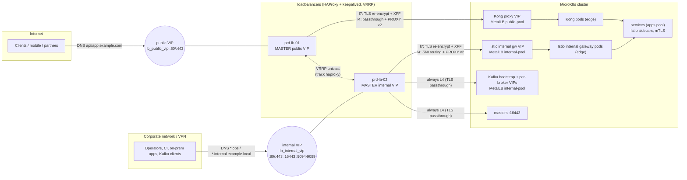

# Load balancing: edge LB pair, MetalLB, Kong and Istio

This page describes how traffic enters the platform: from the Internet or the corporate network to
the edge load balancers, then to MetalLB, then to Kong or the Istio gateways, and finally to a pod.
It also covers how to operate each layer. The names used here are defined in [conventions.md](conventions.md)
("Load balancing (L7 with optional L4)", "External hostnames").

| Layer | Component | Where | Managed by |
|-------|-----------|-------|------------|
| Edge LB (L7 or L4) | HAProxy + keepalived pair, public VIP + internal VIP | VMs in inventory group `loadbalancers` | Ansible role `loadbalancer`, `playbooks/loadbalancers.yml` |
| In-cluster L4 | MetalLB `LoadBalancer` VIPs (`public-pool`, `internal-pool`), L2 by default, BGP optional | `edge` nodes (speakers) | Argo CD `gitops/platform/core/metallb` |
| In-cluster L7 north-south | Kong proxies (public APIs and frontends) | `edge` nodes | `gitops/platform/core/kong` |
| In-cluster L7 internal / east-west | Istio internal gateway (`*.internal`, `*.ops`) and sidecars | `edge` nodes / every pod | `gitops/platform/core/istio-*` |

## Topology



With `lb_vrrp_active_active: true` (production default), each VIP normally runs on a different load
balancer, so both nodes carry traffic. If one node fails, the other one takes over both VIPs. A single
node handles the full 1M-user peak (see [Capacity](#capacity)).

## L7 or L4: which mode to use

`lb_mode` is set in `ansible/inventories/<env>/group_vars/all/loadbalancer.yml`.

| Concern | `l7` (default) | `l4` |
|---------|----------------|------|
| TLS termination | On the LB (HAProxy), then **re-encrypted** to Kong/Istio | In the cluster only (Kong / Istio), passthrough on the LB |
| Where public certs live | On the LB (`/etc/haproxy/certs`) **and** in the cluster (backend hop) | In the cluster only (cert-manager) |
| HTTP/2, ALPN | Client side on HAProxy; h2 to Kong/Istio too | End to end, negotiated with Kong/Istio |
| Client IP to Kong/Istio | `X-Forwarded-For` (Kong `trusted_ips`, Istio `numTrustedProxies: 1`) | PROXY protocol v2 (`send-proxy-v2`) |
| Per-IP rate limiting / connection limits | Yes (requests, errors, connections) | Connections only |
| WAF hook (Coraza SPOA) | Yes (optional) | No |
| Request ID, JSON access log with host/URI/status | Yes | TCP log only (bytes, timings) |
| Host routing | `Host` header | `req.ssl_sni` (SNI) |
| CPU cost on the LB | Higher (TLS handshakes; still well within an 8 vCPU VM) | Minimal |
| Cluster-side change needed | None: the default Kong/Istio values trust XFF from the LB subnet | Kong `proxy_protocol` listeners + `real_ip_header: proxy_protocol`; Istio `proxyProtocol` |
| mTLS client certificates end to end | Not possible (terminated at LB) | Possible |

Use `l7` unless one of the following applies:

- Clients must present certificates to Kong (mTLS end to end).
- A compliance rule says that decrypted traffic must never exist outside the cluster.
- Certificate management must stay entirely in cert-manager.

The option `lb_pure_l4_ipvs: true` replaces the HAProxy `:80`/`:443` frontends with keepalived
LVS/IPVS `virtual_server`s. This is kernel forwarding with no proxy. Use it only if the network can
route replies back through the LB (`lb_kind: NAT`), or if the backends can own the VIP on `lo`
(`lb_kind: DR`). With MetalLB VIPs as real servers, neither is usually true. The option exists for sites
that already run IPVS-based designs. The Kubernetes API, Kafka and metrics stay on HAProxy.

## Request path (l7)

1. The client resolves `api.example.com` to the public VIP. The perimeter firewall NATs 1:1 to
   `lb_public_vip`, which keepalived holds on the active LB.
2. `fe_public_https`:
   1. Terminates TLS 1.2/1.3. HTTP/2 is negotiated with ALPN, and the certificate is chosen by SNI
      from `/etc/haproxy/certs`.
   2. Tracks the source IP in a stick-table. The connection is rejected when `conn_cur` or
      `conn_rate` is over the limit. The request is rejected with HTTP 429 (JSON body) when
      `http_req_rate` or `http_err_rate` is over the limit.
   3. Answers 404 for any host outside `lb_public_domains`. `*.example.local` is never served on the
      public VIP.
   4. Optionally runs the WAF.
   5. Strips client-supplied `X-Forwarded-For`, `X-Real-IP` and `Forwarded`.
   6. Sets `X-Request-ID` (UUIDv4), `X-Forwarded-For`, `X-Real-IP`, `X-Forwarded-Proto: https`,
      `X-Forwarded-Host` and `X-Forwarded-Port`.
3. `be_kong_https` re-encrypts to the Kong proxy VIP (`:443`, SNI = client host, ALPN h2).
4. Kong sees source address `10.10.20.1x`, which is in `trusted_ips`. It takes the client IP from
   `X-Forwarded-For` (`real_ip_recursive on`). The following Kong features then work on the real
   client IP: ip-restriction, rate limiting, logs (`remote_addr`), and OpenTelemetry attributes.
5. Kong routes `/<service>/<version>/...` to the service. The request leaves through Kong's Istio
   sidecar with mTLS, Argo Rollouts weights and retries.

The internal VIP works in the same way. The differences:

- An IP allow-list applies (`lb_internal_allowed_cidrs`).
- There is no per-IP rate limit.
- A client-supplied `X-Request-ID` is kept.
- Routing is by host:
  - `*.example.local` (including `*.ops.example.local`) goes to the Istio internal gateway.
  - `*.example.com` (split-horizon DNS for internal clients) goes to Kong.
  - Anything else goes to Istio.

Port 80 on both VIPs redirects to HTTPS (301). The exception on the public VIP is
`/.well-known/acme-challenge/*`, which is proxied as plain HTTP to Kong, where the cert-manager
HTTP-01 solver lives.

## Request path (l4)

- On the public VIP, `:443` and `:80` are TCP passthrough to the Kong VIP with `send-proxy-v2`.
  Only per-IP connection limits apply.
- On the internal VIP, `:443` reads the SNI of the TLS ClientHello (`req.ssl_sni`), without
  terminating TLS:
  - `*.example.local` goes to the Istio internal gateway.
  - `*.example.com` goes to Kong.
  - Anything else goes to Istio.

  Both backends receive PROXY v2. Internal `:80` goes to Istio `:80` with PROXY v2.
- Kong and Istio terminate TLS with their cert-manager certificates. They read the client IP from
  the PROXY header.

## Always L4, in both modes

| Listener (internal VIP) | Backend | Notes |
|-------------------------|---------|-------|
| `:16443` | every master `:16443`, `balance leastconn`, TLS-handshake health check | Passthrough: kube-apiserver still sees client certificates and tokens. Allowed from `lb_k8s_api_allowed_cidrs` (admin/CI networks). To route kubectl through the LB, point `k8s-api.ops.example.local` at `lb_internal_vip`. That name is already in the API server SANs; if clients use the IP, add the IP to `microk8s_extra_sans`. The masters' own keepalived VIP (`microk8s_api_vip`) keeps working independently. |
| `:9094` | Strimzi `external` bootstrap LoadBalancer VIP | See [Kafka](#kafka). |
| `:9095-9099` | one Strimzi per-broker LoadBalancer VIP each | Only needed when clients must reach brokers through the LB. |

### Kafka

Kafka clients connect to the bootstrap address, then reconnect to each broker's advertised address.
To keep Kafka traffic on the LB, three settings in the Strimzi external listener
(`gitops/platform/data/kafka/manifests/20-kafka.yaml`) must match `lb_kafka_brokers`:

- the MetalLB VIPs are pinned,
- each broker advertises `kafka.internal.example.local`,
- each broker advertises its LB port.

```yaml
configuration:
  bootstrap:
    alternativeNames: [kafka.internal.example.local]
    loadBalancerIP: 10.10.100.20            # = lb_kafka_bootstrap_address
  brokers:
    - broker: 3                             # Strimzi node id (pool "brokers")
      loadBalancerIP: 10.10.100.21          # = lb_kafka_brokers[].address
      advertisedHost: kafka.internal.example.local
      advertisedPort: 9095                  # = lb_kafka_brokers[].listen_port
    # ... brokers 4-7 -> 9096-9099
```

Strimzi adds `advertisedHost` to the broker certificates, so TLS passthrough keeps working. Brokers
then see the LB address as the client IP (`externalTrafficPolicy: Local` preserves only the last
hop), so Kafka ACL host rules must allow the LB subnet. Without these settings the default
`lb_kafka_brokers: []` still works: clients bootstrap through the LB and then connect directly to the
per-broker VIPs, which are routable on the internal VLAN.

## TLS and certificates

| Mode | Public (`*.example.com`) | Internal (`*.example.local`) | Backend hop |
|------|--------------------------|------------------------------|-------------|
| `l7` | On the LB. Sources: `inventories/<env>/files/lb-certs/*.pem` (cert + chain + key, ansible-vault encrypted), `lb_tls_certs` (vault vars), or cert-manager Secrets exported with `lb_tls_k8s_secrets` | On the LB, exported from the cert-manager Secrets `istio-internal/ops-wildcard-tls` and `internal-wildcard-tls` (issuer `internal-ca`) | Kong/Istio keep their own cert-manager certificates. HAProxy verifies them if `lb_backend_tls_verify: true` (see below). |
| `l4` | In the cluster only (cert-manager `letsencrypt-prod` on Kong) | In the cluster only (`internal-ca`) | n/a |

- **Default certificate.** The role generates a self-signed `default.pem`. It is served only for
  unknown SNI names and for clients that send no SNI. It is never valid for a real host.
- **Public certificates in l7 mode** (recommended flow):
  1. Create a cert-manager `Certificate`, for example `kong/lb-public-tls`, for `api.example.com`,
     `app.example.com` and the tenant hosts. Use issuer `letsencrypt-prod`. HTTP-01 works because
     the LB passes `/.well-known/acme-challenge/` through to Kong. Wildcards such as
     `*.api.example.com` need DNS-01.
  2. Add the certificate to `lb_tls_k8s_secrets`.
  3. Run `playbooks/loadbalancers.yml --tags lb_certs` daily from CI (Makefile target
     `lb-certs`). The play reads the Secrets through the controller's kubeconfig, writes
     `/etc/haproxy/certs/k8s-<ns>-<name>.pem`, validates with `haproxy -c` and reloads without
     dropping connections. Let's Encrypt renews 30 days before expiry, so a daily sync leaves a
     wide margin.
- **Internal certificates.** These are exported from cert-manager in the same way. Alternatively,
  enterprise PKI files can be dropped into `files/lb-certs/`.
- **Backend verification.** Set `lb_backend_tls_verify: true` and `lb_backend_ca_src` to a bundle
  that contains every CA the backends present: the internal CA for Istio, and for Kong either the
  internal CA or ISRG Root X1 if Kong serves Let's Encrypt certificates. HAProxy checks the backend
  certificate against the SNI it sends.
- **TLS policy.** TLS 1.2+, ECDHE AEAD ciphers only, TLS 1.3 suites, X25519/P-256/P-384, no session
  tickets (a shared session cache is used instead), HTTP/2 + HTTP/1.1 ALPN. HSTS is
  `lb_hsts_enabled`, off by default because Kong sets it per route.

## Client IP preservation

| Hop | l7 | l4 |
|-----|----|----|
| Client → LB | TCP source IP | TCP source IP |
| LB → Kong/Istio VIP | `X-Forwarded-For` appended (client XFF stripped on the public VIP) | PROXY protocol v2 header |
| MetalLB → pod | `externalTrafficPolicy: Local` (no SNAT, so the pod sees the LB address) | same |
| Kong | `trusted_ips: 10.10.20.0/24,10.20.20.0/24`, `real_ip_header: X-Forwarded-For`, `real_ip_recursive: on` (default in `kong/values.yaml`) | `real_ip_header: proxy_protocol` + `proxy_protocol` in `proxy.http/tls.parameters` |
| Istio internal gateway | `proxy.istio.io/config: gatewayTopology.numTrustedProxies: 1` (default in `istio-internal/values.yaml`) | `gatewayTopology.proxyProtocol: {}` or the commented EnvoyFilter in `istio-internal/manifests/proxy-protocol-envoyfilter.yaml` |

`externalTrafficPolicy: Local` is set on all gateway Services (Kong proxy, Istio ingress and internal,
Kafka). Keep it. With `Cluster`, kube-proxy SNATs to a node IP. That node IP is not in
`trusted_ips`, so the client IP would be lost, and MetalLB could announce the VIP from a node without
a gateway pod.

The Kong default is safe even without an LB. XFF is trusted only when the TCP peer is inside the LB
subnets, so a client that talks to the VIP directly cannot forge its address. Istio's
`numTrustedProxies: 1` does not have this property: a client that bypasses the LB can forge one hop.
This is acceptable on the internal VLAN. To remove it, set `loadBalancerSourceRanges` to the LB subnet
(commented in the values files).

## Health checks

| Check | Target | Method | Effect |
|-------|--------|--------|--------|
| Kong | Kong VIP `:443` (TLS, SNI `lb_kong_health_host`) | `GET /`, any status 1xx-4xx means up (404 "no Route matched" is fine), every 2 s, fall 3 / rise 2. `lb_kong_health_check: tcp` uses a plain connect instead. Kong's status port `:8100` is not exposed on the LB Service. | Server DOWN: 503 JSON error page |
| Istio internal | status port `:15021` `GET /healthz/ready` expect 200 | every 2 s | same |
| API servers | each master `:16443` | TLS handshake | removed from `leastconn` rotation |
| Kafka | bootstrap / broker VIP `:9094` | TCP connect every 5 s | connection refused |
| HAProxy itself | `127.0.0.1:8405/healthz` (`monitor-uri`) | keepalived `vrrp_script` every 2 s, fall 3 | VIPs move to the peer |
| HAProxy process | `vrrp_track_process haproxy` | process table | instance goes to FAULT and the VIPs move within about 2 s |

## Capacity

Target load (see [ansible/README.md](../ansible/README.md) "Sizing"): 1M users, about 50k concurrent
sessions, 15-20k HTTP req/s at the edge.

| Figure | Value |
|--------|-------|
| HAProxy 3.0, 8 vCPU (l7, TLS 1.3, keep-alive, ECDSA P-256) | ~50-100k req/s; ~15-25k **full** TLS handshakes/s |
| HAProxy l4 passthrough | limited by NIC / conntrack, > 1M concurrent connections |
| Peak need | 15-20k req/s, so one LB runs at about 20-35% CPU in l7 mode (N+1 with two nodes) |
| `maxconn` | global 200k, public frontend 150k, internal 30k; backend server 50k |
| Memory | about 32 KiB per active connection worst case (2 x `tune.bufsize`) plus ~200 MB TLS session cache, so **16 GiB** per LB |
| Kernel | `somaxconn` 65535, SYN backlog 65535, `ip_local_port_range` 1024-65535 (backend side ports), `nf_conntrack_max` 2M with hash 512k, fd limit 1M |
| NIC | 2 x 10 GbE (DMZ + internal). 20k req/s x 20 KB average is about 3.2 Gbit/s |

Recommended size: **2 VMs x 8 vCPU / 16 GiB / 40 GB disk**, pinned to different hypervisors or racks
(`topology_zone`). Staging uses 1 x 4 vCPU / 8 GiB. Scale up (vCPU) before scaling out. To scale out,
add a third LB with a third VIP and DNS round robin, or move to BGP/ECMP (announce the VIP from all
LBs through a routing daemon).

## Failover (VRRP)

- Both instances start in `BACKUP` state. The priority is 150 for the VIP's home node and 140 for the
  peer. Adverts are unicast every second between `lb_vrrp_address`es, with PASS authentication from
  `vault_lb_keepalived_auth_pass`. Router IDs are 61 (public) and 62 (internal). The masters' API VIP
  uses 51.
- The active LB loses a VIP in any of these cases:
  - the HAProxy process is gone (`track_process`, about 2 s),
  - the local health URI fails 3 times (about 6 s),
  - the node or keepalived dies (3 missed adverts plus skew, about 3-4 s).

  The peer then sends gratuitous ARPs and serves the VIP. `ip_nonlocal_bind=1` means HAProxy on the
  peer already listens on the VIP address, so no reload is needed.
- Established TCP connections through the failed node are lost. HTTP clients retry, and HTTP/2 and
  gRPC clients reconnect. Stick-table counters start empty on the peer.
- When the home node recovers, it takes its VIP back after `lb_vrrp_preempt_delay` (30 s), so a
  flapping node cannot bounce traffic.
- The notify hook writes `lb_vrrp_master{instance,state}` to the node-exporter textfile collector.
  Alert when `sum by (instance)(lb_vrrp_master) != 1`, which means a split brain or no master.
- Planned maintenance: run `systemctl stop keepalived` on one node (its VIPs move), work on it, then
  start keepalived again. `playbooks/loadbalancers.yml` runs with `serial: 1` for the same reason.

## DNS records

| Name | Type | Value |
|------|------|-------|
| `api.example.com`, `*.api.example.com`, `app.example.com`, `*.app.example.com` (plus `s3.example.com` if published) | A (public) | public IP NATed to `lb_public_vip` (production `203.0.113.5`) |
| same names (split horizon, optional) | A (internal) | `lb_internal_vip` (internal clients reach Kong without hairpin NAT) |
| `*.ops.example.local`, `*.internal.example.local` | A (internal) | `lb_internal_vip` (production `10.10.20.10`) |
| `k8s-api.ops.example.local` | A (internal) | `lb_internal_vip` (through the LB) **or** `microk8s_api_vip` (masters' keepalived); pick one |
| `kafka.internal.example.local` | A (internal) | `lb_internal_vip` (with `lb_kafka_brokers`) or the Strimzi bootstrap VIP |
| `prd-lb-01.ops.example.local`, `prd-lb-02.ops.example.local` | A | node management addresses (metrics, SSH) |

The Kong and Istio MetalLB VIPs do not need public DNS records once the LB is in front.

## Switching modes

### l7 to l4

A short (about 1-2 minute) interruption is expected, so use a maintenance window.

1. Kong (`gitops/platform/core/kong/values.yaml`):
   - set `real_ip_header: proxy_protocol`,
   - remove `real_ip_recursive`,
   - add `proxy_protocol` to `proxy.http.parameters` and `proxy.tls.parameters`.

   Istio internal (`istio-internal/values.yaml`): replace the annotation with
   `gatewayTopology: {numTrustedProxies: 0, proxyProtocol: {}}`. As an alternative, uncomment
   `manifests/proxy-protocol-envoyfilter.yaml`, which leaves mesh-expansion ports without PROXY
   protocol.
2. Set `lb_mode: l4` in `group_vars/all/loadbalancer.yml`.
3. Merge the change and let Argo CD sync Kong and Istio, then immediately run:

   ```bash
   ansible-playbook -i inventories/production/hosts.yml playbooks/loadbalancers.yml --tags lb_haproxy
   ```

   Traffic fails until both sides agree.
4. Verify:
   - Kong access logs show real client IPs in `remote_addr`,
   - `curl -v https://api.example.com` shows Kong's certificate,
   - the HAProxy stats show all servers UP.

### l4 to l7

Reverse the same steps. Also make sure the LB has certificates (`lb_tls_k8s_secrets` / `lb-certs`)
**before** you run the play. Otherwise clients receive the self-signed default certificate.

Direct clients (anything that reaches the Kong VIP without going through the LB) stop working in `l4`
mode, because Kong then requires a PROXY header.

## MetalLB, Kong and Istio behind the LB

- **MetalLB** is the in-cluster L4 layer. It gives each gateway Service a stable VIP on the edge
  nodes, which is where the LB sends traffic. It runs in L2 mode by default: one edge node answers ARP
  per VIP and fails over in a few seconds. Pin the VIPs the LB uses with
  `metallb.io/loadBalancerIPs` (commented in the Kong and Istio values; defaults are the first
  address of each pool, `lb_backend_kong_vip` / `lb_backend_istio_internal_vip`).
- **BGP option.** Enable `frrk8s` and apply `gitops/platform/core/metallb/manifests/bgp-example.yaml`.
  Every edge node that runs a gateway pod then announces the VIP as a /32. The ToR switches ECMP
  across the nodes, which gives real multi-node load spreading below the LB and sub-second failover
  with BFD. The LB configuration does not change, because it still targets one VIP. For a larger
  site you can peer the LBs with BGP as well and drop VRRP.
- **Kong** is north-south L7: auth (JWT/OIDC), tenant routing, rate limiting per consumer or tenant,
  request transformation. The LB does not replace any of this. It adds TLS offload, coarse per-IP
  protection, a WAF and HA VIPs outside the cluster failure domain.
- **Istio** handles internal L7: the internal gateway for ops and hybrid traffic, and sidecars for
  east-west mTLS, retries and canary weights. The edge LB never sends traffic to pods directly.
- To bypass HAProxy and balance on nodes, set `lb_kong_servers` / `lb_istio_internal_servers` to a
  list of edge-node addresses with a NodePort. HAProxy then health-checks each node itself.

## WAF (optional, Coraza SPOA)

1. Install `coraza-spoa` on both LBs (binary or container), with OWASP CRS and
   `SecRuleEngine DetectionOnly` first. Have it listen on `lb_waf_spoa_address` (default
   `127.0.0.1:9000`).
2. Set `lb_waf_enabled: true`. The role then:
   - renders `/etc/haproxy/coraza-spoe.cfg`,
   - adds `filter spoe` + `option http-buffer-request` to `fe_public_https`,
   - denies with 403 when Coraza returns action `deny`.
3. `lb_waf_fail_open: true` (default) lets requests through if the agent is down or times out
   (500 ms budget). Set it to `false` for fail-closed (503).
4. Tune the rules on the detection logs, then switch Coraza to `SecRuleEngine On`. Expect +1-3 ms
   latency and roughly double the CPU for requests with bodies.

The WAF is not available with `lb_pure_l4_ipvs`, and has no effect in `l4` mode, where the request is
encrypted on the LB.

## Monitoring and logging

- **Metrics.** HAProxy's native Prometheus exporter is at `http://<lb>:8404/metrics`, and node-exporter
  is at `:9100`. Both are allowed only from `lb_stats_allowed_cidrs` / `lb_metrics_allowed_cidrs` (node
  networks, where Prometheus runs, and admin networks), enforced by ufw and by an HAProxy ACL. An HTML
  stats page is at `/stats`, with basic auth `vault_lb_stats_password`, and is disabled when empty.
  They are scraped by `gitops/platform/observability/kube-prometheus-stack/manifests/edge-loadbalancers.yaml`
  (ScrapeConfig + alerts; keep its targets in sync with the inventory):

  ```yaml
  apiVersion: monitoring.coreos.com/v1alpha1
  kind: ScrapeConfig
  metadata: {name: edge-loadbalancers, namespace: monitoring}
  spec:
    staticConfigs:
      - targets: ["10.10.20.11:8404", "10.10.20.12:8404"]
        labels: {job: haproxy, env: production}
      - targets: ["10.10.20.11:9100", "10.10.20.12:9100"]
        labels: {job: lb-node, env: production}
  ```

  Suggested alerts:
  - `haproxy_backend_active_servers == 0`
  - 5xx ratio per frontend
  - `haproxy_frontend_current_sessions / haproxy_frontend_limit_sessions > 0.8`
  - `sum by (instance)(lb_vrrp_master) != 1`
  - certificate expiry (`haproxy` does not export it, so use blackbox-exporter `probe_ssl_earliest_cert_expiry` against the VIPs)
- **Logs.** There is one JSON object per request or connection in `/var/log/haproxy.log`. rsyslog
  reads it from the chroot socket, and it is rotated daily and kept for 14 days. HTTP fields:
  `timestamp`, `request_id`, `client_ip`, `frontend`, `backend`, `server`, `method`, `host`, `uri`,
  `status`, bytes, `time_*_ms`, `termination_state`, TLS version and cipher, `user_agent`. TCP entries
  carry the connection fields only. Ship the file to Elasticsearch with Fluent Bit or Elastic Agent
  (index `logs-loadbalancer`). keepalived logs to journald (`journalctl -u keepalived`).

## Operations cheat sheet

```bash
# Deploy / update (serial, one LB at a time; haproxy -c validates before any reload)
ansible-playbook -i inventories/production/hosts.yml playbooks/loadbalancers.yml --vault-id production@prompt
ansible-playbook -i inventories/production/hosts.yml playbooks/loadbalancers.yml --tags lb_certs    # cert sync
ansible-playbook -i inventories/production/hosts.yml playbooks/loadbalancers.yml --tags lb_haproxy  # config only

# On a load balancer
ip -br addr | grep -E '203.0.113.5|10.10.20.10'          # who holds which VIP
journalctl -u keepalived -n 50                            # VRRP transitions
echo "show stat" | socat stdio /run/haproxy/admin.sock | cut -d, -f1,2,18 | column -s, -t
echo "set server be_kong_https/kong-vip state drain" | socat stdio /run/haproxy/admin.sock
echo "show table st_src_public" | socat stdio /run/haproxy/admin.sock | head   # rate-limit counters
haproxy -c -f /etc/haproxy/haproxy.cfg && systemctl reload haproxy            # manual hitless reload
tail -f /var/log/haproxy.log | jq -c '{status, host, uri, client_ip, time_total_ms}'
```

Firewall on the LBs (ufw, default deny):

| Port | Source |
|------|--------|
| SSH | `platform_admin_cidrs` |
| VRRP | peer LBs only |
| public VIP `:80`/`:443` | any |
| internal VIP `:80`/`:443` | `lb_internal_allowed_cidrs` |
| `:16443` | `lb_k8s_api_allowed_cidrs` |
| Kafka ports | `lb_kafka_allowed_cidrs` |
| `:8404`/`:9100` | monitoring networks |

The `hardening` role (sshd, auditd, unattended security updates, kernel) runs on the LBs as well.
