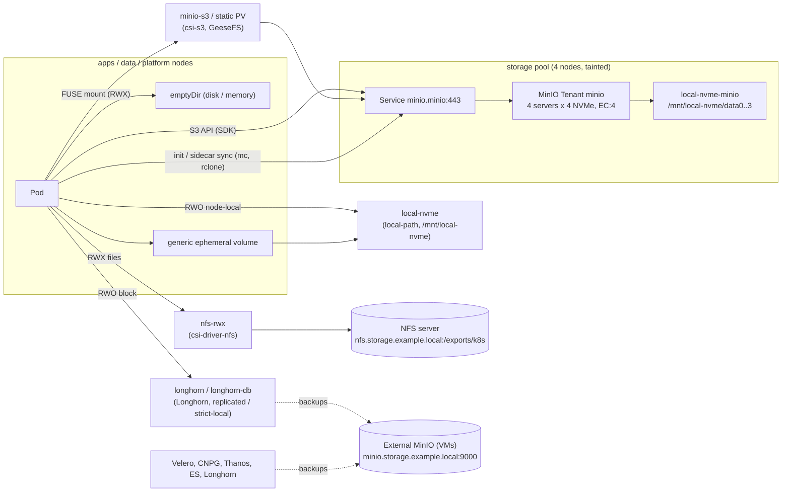

# Storage

This page explains how to pick storage for a workload (block, file, object or ephemeral), which StorageClasses and
endpoints exist, and how the in-cluster object store (MinIO) and the CSI drivers are set up. The naming contract
lives in [conventions.md](conventions.md) ("Storage classes", "Object storage (MinIO)"). Node sizing is in
[capacity-planning.md](capacity-planning.md).

Related: [chart-interfaces.md](chart-interfaces.md) (how `charts/microservice` / `charts/frontend` mount storage),
[multi-tenancy.md](multi-tenancy.md), `charts/tenant` (`data.objectStorage`).

## Overview



Backups never land on the in-cluster MinIO: they go to the external MinIO on VMs, which sits outside the
cluster's failure domain (see [Backups](#backups-external-minio)).

## Decision table

| Need | Use | Access | Latency / throughput | Survives pod reschedule | Survives node loss | Backed up by | Never for |
|------|-----|--------|----------------------|-------------------------|--------------------|--------------|-----------|
| General stateful app data (block) | `longhorn` (default SC) | RWO (RWX via Longhorn share-manager) | network + 3-way replica write | yes | yes (3 replicas) | Longhorn snapshots/backups, Velero Kopia | very high IOPS databases that replicate themselves |
| Databases / brokers that replicate themselves | `longhorn-db` | RWO | near-local (strict-local, 1 replica) | only on the same node | no, the application replicates | native tools (CNPG barman, Kafka, ES snapshots) | apps without their own replication |
| Fastest node-local disk: caches, scratch, build dirs, MinIO drives | `local-nvme` | RWO, node-bound | local NVMe | only on the same node (the pod is pinned to the node) | **no** | **nothing** (hostPath PVs are not supported by Velero fs-backup) | anything you cannot rebuild |
| Shared files, many writers, POSIX semantics | `nfs-rwx` | RWX | NFS server bound | yes | yes (data is on the NFS server) | NFS server snapshots/backups | databases, SQLite, heavy small-file metadata churn |
| Object data read/written by the application | **MinIO S3 API via SDK** (`S3_*` env from `charts/microservice objectStorage`) | many clients | high throughput, per-request latency (ms) | yes | yes (EC:4) | bucket versioning; replicate important buckets to the external MinIO | – |
| Legacy code that needs a directory view of a bucket | `minio-s3` (dynamic) or a static PV on a tenant bucket (csi-s3 FUSE) | RWX | FUSE + S3 round trips; good for large sequential files | yes | yes | as the bucket | **databases**, locks, atomic rename, append-heavy logs, `fsync`-dependent writers |
| Seed files at start / publish results | init container or sidecar sync (`mc mirror`, `rclone`) into an `emptyDir` | pod-local copy | local disk after the copy | re-synced at start | re-synced | as the bucket | large datasets (start-up time) |
| Temporary per-pod space | `emptyDir` (disk) with `sizeLimit` | pod | node disk | no | no | – | data you need after the pod ends |
| Temporary in-memory space | `emptyDir: {medium: Memory, sizeLimit}` | pod | RAM (counts to the memory limit) | no | no | – | large files (OOM kill) |
| Large per-pod scratch with a real volume | generic ephemeral volume on `local-nvme` (or `longhorn`) | pod | local NVMe / network | no (deleted with the pod) | no | – | data you need after the pod ends |

Rules of thumb:

* Prefer the **S3 API** over mounts. The SDK path has clear semantics (whole-object PUT/GET, versioning,
  pre-signed URLs) and no FUSE daemon in between. All consumers read the endpoint from `S3_ENDPOINT` /
  `S3_FORCE_PATH_STYLE`, so the object store behind it can be replaced (see [alternatives](#minio-distribution-status-and-alternatives)).
* Use a mount only when the code needs a filesystem path and cannot be changed. Use a sync container when
  the data set is small and read-mostly.
* Tenants must not use `longhorn-db` (quota 0 through `charts/tenant` `deniedStorageClasses`).

## StorageClasses

| Class | Provisioner | Binding | Reclaim | Expansion | Defined in |
|-------|-------------|---------|---------|-----------|------------|
| `longhorn` (default) | `driver.longhorn.io`, 3 replicas, best-effort locality | Immediate | Delete | yes | `gitops/platform/core/longhorn/manifests/storageclasses.yaml` |
| `longhorn-db` | `driver.longhorn.io`, 1 replica, strict-local, XFS | WaitForFirstConsumer | Retain | yes | same |
| `local-nvme` | `cluster.local/local-path-provisioner`, hostPath under `/mnt/local-nvme` | WaitForFirstConsumer | Delete | no (no quota, size is not enforced) | `gitops/platform/core/local-path-provisioner/values.yaml` |
| `local-nvme-minio` | same provisioner, `pathPattern` → `/mnt/local-nvme/dataN/...` | WaitForFirstConsumer | Retain | no | same (MinIO Tenant only) |
| `nfs-rwx` | `nfs.csi.k8s.io`, `nfs.storage.example.local:/exports/k8s`, subDir `<namespace>/<pvc>` | Immediate | Retain (+ `onDelete: retain`) | yes (quota on the NFS server) | `gitops/platform/core/csi-driver-nfs/manifests/storageclass.yaml` |
| `minio-s3` | `ru.yandex.s3.csi`, GeeseFS, bucket `platform-pvc`, prefix per PV | Immediate | Delete (removes the prefix) | n/a (size is not enforced) | `gitops/platform/core/csi-s3/manifests/50-storageclass.yaml` |

### Node disk layout (contract with Ansible `storage_prep`)

| Pool | Disks | Mount points |
|------|-------|--------------|
| `apps`, `data` (and others that should offer `local-nvme`) | 1 local NVMe (or an LVM LV) formatted XFS | `/mnt/local-nvme` |
| `storage` (4 nodes) | 4 × 8 TB NVMe, each formatted XFS (no RAID, no LVM: MinIO does the erasure coding) | `/mnt/local-nvme/data0`, `/mnt/local-nvme/data1`, `/mnt/local-nvme/data2`, `/mnt/local-nvme/data3` |

On storage nodes `/mnt/local-nvme` itself is only the parent directory of the four mounts. The class
`local-nvme-minio` renders the path `{{ slice .PVC.Name 0 5 }}/<namespace>/<pvc>`. The MinIO operator names the
drive claims `data0-minio-pool-0-<n>` … `data3-minio-pool-0-<n>`, so each of the four drives of a server lands on a
different physical disk (for example `/mnt/local-nvme/data2/minio/data2-minio-pool-0-1`). The plain `local-nvme`
class picks a path at random when a node lists several, so it must not be used for MinIO drives. Mount the
disks with `nofail`, and make kubelet start only after the mounts are up (systemd `RequiresMountsFor=`). Otherwise
a missing disk silently turns into a directory on the OS disk.

## Block storage (Longhorn, local-nvme)

* `longhorn`: the default. Recurring snapshots and backups are attached through the StorageClass
  `recurringJobSelector` (see `longhorn/manifests/recurringjobs.yaml`).
* `longhorn-db`: data stays on the node where the pod first ran (strict-local). Use it only for systems that
  replicate themselves: Postgres (CNPG), Kafka, RabbitMQ, Redis, Elasticsearch, Vault raft.
* `local-nvme`: the fastest option. The PV has node affinity, so the pod can only run on that node again. When
  the node is lost, delete the PVC (and the pod) to recreate the volume elsewhere, empty. Nothing backs it up.

## File storage (NFS)

`nfs-rwx` gives ReadWriteMany with normal POSIX semantics (NFSv4.1 locks, atomic rename, `hard` mounts). Each PVC
gets its own directory `/exports/k8s/<namespace>/<pvc>`. Deleting the PVC keeps the directory (Retain +
`onDelete: retain`). Clean up on the NFS server after the retention period. The NFS server must export
`/exports/k8s` to the node networks with `no_root_squash` (the controller creates the per-PVC directories).
Capacity and quotas are enforced on the NFS server.

Caveats: throughput is bounded by the NFS server, and metadata-heavy workloads (millions of small files) are slow.
Do not put SQLite or other embedded databases on NFS. Inline NFS volumes are disabled (`feature.enableInlineVolume: false`),
so tenants cannot mount arbitrary NFS servers.

VolumeSnapshots: the snapshot CRDs and snapshot-controller are not installed. `csi-driver-nfs/manifests/optional/volumesnapshotclass.yaml`
describes how to enable them. NFS snapshots are tar.gz copies on the same server, not backups.

## Object storage (in-cluster MinIO)

| Item | Value |
|------|-------|
| S3 endpoint (contract) | `https://minio.minio.svc.cluster.local` = Service `minio`, port 443 → pod port 9000 (path-style, region `us-east-1`) |
| Headless (server-to-server) | `minio-hl.minio.svc.cluster.local:9000`, pods `minio-pool-0-{0..3}.minio-hl.minio.svc.cluster.local` |
| Console | `https://minio-console.ops.example.local`: Istio internal gateway → `minio-console.minio.svc:9443` (TLS re-encrypted, verified with `istio-internal/upstream-ca`) |
| Public S3 (optional) | `https://s3.example.com` through Kong. `minio/manifests/optional/public-s3-ingress.yaml` is **not synced**; move it to `manifests/` after a security review |
| Topology | 1 pool `pool-0`: 4 servers × 4 drives on the `storage` pool (nodeSelector + toleration `workload-tier=storage`), required anti-affinity per host, spread across `topology.kubernetes.io/zone` when labelled |
| Erasure coding | `MINIO_STORAGE_CLASS_STANDARD=EC:4` (one erasure set of 16 drives: 12 data + 4 parity), `RRS=EC:2` |
| TLS | cert-manager `Certificate minio/minio-tls` (ClusterIssuer `internal-ca`), `externalCertSecret` type `cert-manager.io/v1`, `requestAutoCert: false`. SANs: `minio.minio.svc.cluster.local`, `*.minio-hl.minio.svc.cluster.local`, `minio-console.ops.example.local`, `s3.example.com` (+ short forms) |
| Operator trust | Secret `minio-operator/operator-ca-tls-internal-ca` (`ca.crt` from Vault `secret/platform/internal-ca-public`). The operator trusts every `operator-ca-tls*` secret |
| Root credentials | Vault `secret/platform/minio` keys `root-user`, `root-password` → Secret `minio/minio-env-configuration` key `config.env` (`export MINIO_ROOT_USER=…` / `export MINIO_ROOT_PASSWORD=…`) |
| Platform buckets | `platform-app-assets` (versioned), `shared-files` (versioned), `platform-pvc` (csi-s3 dynamic volumes, not versioned). Declared in `Tenant.spec.buckets` |
| Lifecycle defaults | versioned buckets: noncurrent versions expire after 30 days, expired delete markers are removed (`mc ilm rule import`, Job `minio-bootstrap`). Incomplete multipart uploads: server-side `MINIO_API_STALE_UPLOADS_EXPIRY=24h` (MinIO has no `AbortIncompleteMultipartUpload` ILM action) |
| Metrics | `MINIO_PROMETHEUS_AUTH_TYPE=public`, ServiceMonitor `minio/minio` (HTTPS, CA from `minio-tls`), paths `/minio/v2/metrics/{cluster,node,bucket}`, job `minio`. PrometheusRule `minio/minio` (nodes/drives offline, write quorum at risk, capacity < 20 % / 10 %) |
| Availability | PDB `maxUnavailable: 1`, PriorityClass `platform-critical`, `podManagementPolicy: Parallel` |
| Network | `default-deny-ingress`. Port 9000 is allowed from `tenant-*` (label `platform.example.com/tenant`), `platform.example.com/category=data` namespaces, `shared-services`, `csi-s3`, `velero`, `harbor`, `monitoring`, `istio-internal`, `kong`, `minio-operator` and the namespace itself. Port 9443 is allowed from `istio-internal` and `minio-operator` only |
| Mesh | namespace `minio` is **not** injected. MinIO terminates TLS itself and must be reachable by non-mesh clients (FUSE mounts, operator). Meshed clients pass the TLS stream through their sidecar |

### Capacity

Usable capacity = raw × data / (data + parity) = raw × 12/16 = **raw × 0.75** with EC:4 on 16 drives.

| | Value |
|---|---|
| Raw | 4 nodes × 4 × 8 TB = 128 TB (≈ 116 TiB) |
| Usable (EC:4) | 96 TB (≈ 87 TiB), before XFS overhead |
| Plan to fill | ≤ 80 % → ≈ 77 TB of objects (alerts at 80 % and 90 % used) |
| Failure tolerance | any 4 drives, one whole server included. Reads need 12 drives and writes need 12 drives (write quorum = data shards when parity < N/2) |
| Expansion | add a **second pool** (another 4+ servers × 4 drives) to `values.yaml` `pools`. Pools cannot be resized in place |

Versioned buckets hold extra copies (noncurrent versions for 30 days). Size them with the versioning overhead included.

### Provisioning Jobs (contract for `charts/tenant`)

Per-tenant buckets, users and policies are created by Jobs that `charts/tenant` renders into namespace `minio`
(Argo CD Sync hooks, project `tenants`, destination `minio` allowed). The platform provides:

| Item | Name / keys |
|------|-------------|
| Admin credentials Secret | `minio/minio-provisioner-credentials`: `MINIO_ROOT_USER`, `MINIO_ROOT_PASSWORD`, `MC_HOST_minio` (`https://<user>:<password>@minio.minio.svc.cluster.local`, query-escaped. Keep the root password alphanumeric) |
| CA to trust MinIO | Secret `minio/minio-tls`, key `ca.crt` (internal CA). Copy it to `$MC_CONFIG_DIR/certs/CAs/` (or `~/.mc/certs/CAs/`). Never use `--insecure` |
| Network | `allow-intra-namespace` lets any pod in `minio` reach port 9000 |
| Image | `harbor.ops.example.local/platform/mc:RELEASE.2025-08-13T08-35-41Z` (see [Images](#images-built-from-source)), must contain `/bin/sh` |
| Pod Security | namespace `minio` enforces `baseline` (Jobs should still be `restricted`-compliant) |

The platform's own Job `minio-bootstrap` (PostSync hook) uses the same Secret and CA. It creates the user `csi-s3` (Vault
`secret/platform/csi-s3` keys `access-key`, `secret-key`) with policy `csi-s3-platform-pvc` (bucket `platform-pvc`
only).

### MinIO distribution status and alternatives

Checked on **2026-09-24** from the build network. Re-check before relying on it.

| Artifact | Status |
|----------|--------|
| `github.com/minio/minio` (server) | README says *"THIS REPOSITORY IS NO LONGER MAINTAINED"* and *"The MinIO community edition is now distributed as source code only"*. Last release tag `RELEASE.2025-10-15T17-29-55Z`. AGPLv3 |
| Server images `quay.io/minio/minio`, `docker.io/minio/minio` | anonymous pull denied (401). `minio/minio` is no longer listed on Docker Hub |
| Binaries `dl.min.io/.../archive/minio.RELEASE.*` and `mc.RELEASE.*` | HTTP 410 Gone |
| `mc` client | last tag `RELEASE.2025-08-13T08-35-41Z`, images not pullable (same as the server) |
| Operator Helm repo `https://operator.min.io` | charts `operator` and `tenant` **7.1.1** are the latest (index unchanged since 2025-05). Pinned |
| Operator images | `quay.io/minio/operator:v7.1.1` and `quay.io/minio/operator-sidecar:v7.0.1` are still pullable. Operator repository: last commit 2025-10, no newer release |
| Commercial | MinIO **AIStor** (Free: single-node, community licence; Enterprise: distributed, subscription) |

What this repository does: it keeps the operator (7.1.1, upstream images) and runs the server from an image
**built from the AGPL source tag** and published to Harbor (`harbor.ops.example.local/platform/minio`). No security
fixes will come from upstream for this build, so plan a decision within the platform's support window:

| Option | Notes |
|--------|-------|
| **MinIO AIStor** (commercial) | Same S3 API, operator and tooling. Needs a licence. Change `tenant.image` (and the operator if AIStor requires its own) |
| **Ceph RGW via Rook** | Mature, S3 + Swift, multi-site. Heavier to run (MON/OSD/MGR). Can also provide block (RBD) and file (CephFS), which could replace Longhorn and NFS |
| **SeaweedFS** | Light, fast for small files, S3 gateway + filer, Apache 2.0. Smaller S3 feature coverage (check versioning / object lock / ILM needs) |
| **Garage** | Very light, geo-distributed, AGPL. Limited S3 feature set (no versioning / object lock / lifecycle beyond basics) |

The backend can be swapped because of these contracts: applications only see `S3_ENDPOINT`, `S3_REGION`, `S3_BUCKET`,
`S3_ACCESS_KEY`, `S3_SECRET_KEY` and `S3_FORCE_PATH_STYLE` (from `charts/microservice`); csi-s3 only needs the
`endpoint` key in its Secret; backups use the external endpoint. A replacement must provide the Service name
`minio.minio.svc.cluster.local:443` (or the endpoint variables must change in one place), path-style S3, SigV4,
bucket versioning and per-user bucket policies. MinIO-specific pieces to replace: `mc admin` calls in the
provisioning Jobs, ServiceMonitor metric names and alerts, and the console.

### Images built from source

| Image | Source | Notes |
|-------|--------|-------|
| `harbor.ops.example.local/platform/minio:RELEASE.2025-10-15T17-29-55Z` | `github.com/minio/minio` tag `RELEASE.2025-10-15T17-29-55Z` | `CGO_ENABLED=0 go build -trimpath -ldflags "$(go run buildscripts/gen-ldflags.go)"`. Runtime: minimal image with CA certificates, `ENTRYPOINT ["/usr/bin/minio"]` (the operator passes only `args: [server, …]`), UID 1000 |
| `harbor.ops.example.local/platform/mc:RELEASE.2025-08-13T08-35-41Z` | `github.com/minio/mc` tag `RELEASE.2025-08-13T08-35-41Z` | Runtime must contain `/bin/sh` (the Jobs run shell scripts), e.g. `alpine` + CA certificates |

CI builds them like the other platform images: Trivy scan and signature, then a push to the Harbor project `platform`.
AGPLv3 applies: publish any source changes you make.

## CSI S3 (FUSE mounts of buckets)

Driver: **yandex-cloud/k8s-csi-s3 0.43.7** (chart `csi-s3` 0.43.7 from `https://yandex-cloud.github.io/k8s-csi-s3/charts`,
**vendored** as manifests in `gitops/platform/core/csi-s3/manifests`, because the chart cannot add the CA trust or the node
placement). Facts verified in the source at tag `v0.43.7`:

| Fact | Value | Source |
|------|-------|--------|
| Driver name | `ru.yandex.s3.csi` | `pkg/driver/driver.go` (`driverName`) |
| Secret keys | `accessKeyID`, `secretAccessKey`, `endpoint`, `region` (optional) | `pkg/s3/client.go` `NewClientFromSecret` |
| volumeHandle | `<bucket>` (whole bucket) or `<bucket>/<prefix>` (split at the first `/`) | `pkg/driver/controllerserver.go` `volumeIDToBucketPrefix` |
| Dynamic volumes | without the `bucket` parameter: **one bucket per PV** named after the PV. With `bucket`: prefix `<pv-name>` inside that bucket. Delete removes the prefix (or the bucket) | `CreateVolume` / `DeleteVolume` |
| volumeAttributes | `mounter` (`geesefs` default), `options` (GeeseFS flags), `capacity` (bytes, optional) | `pkg/driver/nodeserver.go` `getMeta` |
| Secrets used at mount | NodeStage (mount) and NodePublish (re-mount after a crash) | `nodeserver.go` |
| Access mode | only `MULTI_NODE_MULTI_WRITER` is validated (use `ReadWriteMany`; `ReadOnlyMany` works for read-only PVs) | `ValidateVolumeCapabilities` |
| `readOnly` | **not implemented** by the driver ("TODO: Implement readOnly"). Enforce it with `readOnly: true` on the container `volumeMount`, `-o ro` in `options` and/or a read-only MinIO policy | `NodePublishVolume` |
| Systemd mode | default: GeeseFS is started as a **host** systemd unit, which cannot resolve `*.svc.cluster.local` or trust the internal CA. **`--no-systemd` is required** on this platform (GeeseFS runs inside the node plugin pod) | `pkg/mounter/geesefs.go` |

Patches compared with the upstream chart (marked `PATCH` in the manifests): MicroK8s kubelet root
`/var/snap/microk8s/common/var/lib/kubelet`, the internal CA mounted and added through `SSL_CERT_DIR`, CSIDriver
`fsGroupPolicy: None` (GeeseFS does not store owners, so "File" would walk the whole bucket), node affinity and tolerations
for the `apps`, `data`, `storage`, `platform` and `observability` pools, priority classes, resources, and **`updateStrategy: OnDelete`**.
Because GeeseFS runs inside the node plugin pod (`--no-systemd`), restarting that pod breaks the mounts on its node
("transport endpoint is not connected") until the consuming pods restart. To upgrade, go node by node:
`kubectl drain <node>` → delete the `csi-s3` pod on that node → uncordon. Budget the node plugin memory as roughly
512 MiB × the number of mounts on the node (`--memory-limit 512`, limit 8 Gi).

Semantics and caveats (GeeseFS on S3):

* No POSIX locks (`flock`/`fcntl`), no hard links, no persisted permissions or owners (`--dir-mode 0777 --file-mode 0666`).
* Rename is copy + delete: it is not atomic, and slow for large files and directories.
* Close-to-open consistency at best. Other mounts see changes after a flush/close and the metadata cache TTL, so
  two writers on one file lose data.
* Random writes rewrite whole objects (or parts), and appends are expensive.
* **Never** put databases, queues, SQLite, Git repositories or anything that depends on `fsync` or locking on it.
* Good for large, mostly sequential reads and writes: media, exports, model and asset files.

### Dynamic volumes: StorageClass `minio-s3`

```yaml
apiVersion: v1
kind: PersistentVolumeClaim
metadata: {name: reports, namespace: tenant-acme}
spec:
  storageClassName: minio-s3
  accessModes: [ReadWriteMany]
  resources: {requests: {storage: 50Gi}}   # informational only: S3 volumes have no size limit
```

The PV lives at `platform-pvc/pvc-<uid>/` with the **platform** credentials (Secret `csi-s3/csi-s3-platform`, MinIO user
`csi-s3`). The volume is isolated from other PVs by Kubernetes PVC binding, not by S3 credentials, and the tenant cannot
read the prefix through the S3 API. Deleting the PVC deletes the prefix. Tenant credentials cannot be used for dynamic
volumes: the prefix is derived from the PV name, so each tenant user would need rights on the whole shared bucket (or
on per-PV buckets). Use a static PV on a tenant bucket when the data must also be reachable through the S3 API.

### Static bucket mount (exact spec)

A static PV mounts an existing tenant bucket (or a prefix of it) with the tenant's own credentials. `charts/tenant`
(`data.objectStorage.volumes`) renders exactly this. Requirements:

* Bucket `<tenant>-<purpose>` exists and the MinIO user of the tenant has read/write (or read) on it.
* Secret `tenant-s3-credentials` in the **tenant namespace** has the keys `accessKeyID`, `secretAccessKey`,
  `endpoint` (`https://minio.minio.svc.cluster.local`), `region` (`us-east-1`), next to the `S3_*` keys used by apps.
  The kubelet reads it (`nodeStageSecretRef` / `nodePublishSecretRef`), so no extra RBAC is needed.
* PV name is `<tenant>-<name>` (PVs are cluster-scoped: the name must be globally unique). `storageClassName: ""` on
  both objects, `claimRef` on the PV and `volumeName` on the PVC so that nothing else can bind or provision.
* `persistentVolumeReclaimPolicy: Retain`: csi-s3 never deletes a static bucket or prefix.
* `options` must contain `--no-systemd`.

```yaml
apiVersion: v1
kind: PersistentVolume
metadata:
  name: acme-product-images                 # <tenant>-<name>, cluster-unique
  labels:
    platform.example.com/tenant: acme
    platform.example.com/bucket: acme-files
spec:
  storageClassName: ""
  capacity:
    storage: 50Gi                           # informational (required field); not enforced
  accessModes: [ReadWriteMany]              # ReadOnlyMany for read-only mounts
  persistentVolumeReclaimPolicy: Retain
  claimRef:
    apiVersion: v1
    kind: PersistentVolumeClaim
    namespace: tenant-acme
    name: product-images
  csi:
    driver: ru.yandex.s3.csi
    volumeHandle: acme-files/images         # "<bucket>" or "<bucket>/<prefix>" (no leading/trailing "/")
    volumeAttributes:
      mounter: geesefs
      options: "--no-systemd --memory-limit 512 --dir-mode 0777 --file-mode 0666"   # read-only: append "-o ro"
    nodeStageSecretRef:
      name: tenant-s3-credentials
      namespace: tenant-acme
    nodePublishSecretRef:
      name: tenant-s3-credentials
      namespace: tenant-acme
---
apiVersion: v1
kind: PersistentVolumeClaim
metadata:
  name: product-images
  namespace: tenant-acme
spec:
  storageClassName: ""
  volumeName: acme-product-images
  accessModes: [ReadWriteMany]
  resources:
    requests:
      storage: 50Gi
```

The pod mounts the claim like any PVC (`charts/microservice` `objectStorage.mounts[]` with `mode: csi`). Set
`readOnly: true` on the `volumeMount` for read-only use. AppProject `tenants` allows cluster-scoped `PersistentVolume`
and namespaced `PersistentVolumeClaim` for this. A Kyverno policy could also check that tenant PVs use
`ru.yandex.s3.csi` with secret references in their own namespace only (recommended, not implemented yet).

## Ephemeral storage

| Option | Where the bytes go | Limits and eviction |
|--------|--------------------|---------------------|
| `emptyDir: {}` | node disk under `/var/snap/microk8s/common/var/lib/kubelet/pods` | counts toward the container's `ephemeral-storage` usage. `sizeLimit` → the pod is evicted when it is exceeded |
| `emptyDir: {medium: Memory, sizeLimit: 256Mi}` | tmpfs | counts toward the **memory** limit (OOM kill). Always set `sizeLimit` |
| Container writable layer + logs | node disk | `resources.requests/limits.ephemeral-storage` (a pod over its limit is evicted). `charts/tenant` LimitRange sets defaults and the quota caps the sum |
| Generic ephemeral volume (`volumes[].ephemeral.volumeClaimTemplate`) | a real PVC created and deleted with the pod: `local-nvme` (fast, node-bound, no capacity isolation) or `longhorn` (replicated, slower, survives nothing after the pod ends anyway) | counts as a PVC against the namespace quota (`requests.storage`, per-class quotas). Not counted in `ephemeral-storage` |
| CSI inline ephemeral volumes | – | not offered: csi-driver-nfs has inline volumes disabled and csi-s3 only supports `Persistent` |

The kubelet also evicts pods when the node itself runs low (`nodefs.available` / `imagefs.available`). Pods that exceed
their requests are evicted first, so set realistic `ephemeral-storage` requests. See runbook
[NodeDiskPressureCritical](runbooks/NodeDiskPressureCritical.md).

## Backups (external MinIO)

Backups stay on the **external** MinIO on VMs (Ansible role `minio_server`, inventory group `minio_servers`,
`https://minio.storage.example.local:9000`), outside the Kubernetes failure domain. They are not moved to the in-cluster
tenant. Current consumers, as referenced in the manifests:

| Consumer | Bucket (prefix) | Vault path → keys | Defined in | Endpoint in the manifest |
|----------|-----------------|-------------------|------------|--------------------------|
| Velero (BSL `default`) | `velero-backups` (`microk8s-prod`) | `secret/platform/velero` → `s3-access-key`, `s3-secret-key` | `core/velero/values.yaml`, `manifests/credentials.yaml` | `https://minio.backup.example.local:9000` (placeholder) |
| Longhorn backup target | `longhorn-backups` (`microk8s-prod`) | `secret/platform/longhorn` → `s3-access-key`, `s3-secret-key`, `s3-endpoint`, `s3-ca-cert` | `core/longhorn/values.yaml`, `manifests/backup-credentials.yaml` | taken from Vault `s3-endpoint` |
| CNPG barman-cloud (`pg-main`) | `pg-backups` (`site-a/`) | `secret/platform/postgres-backup` → `ACCESS_KEY_ID`, `ACCESS_SECRET_KEY` (+ `ca.crt`) | `data/postgres/manifests/10-objectstore.yaml`, `00-externalsecrets.yaml` | `https://minio.backup.example.local:9000` (placeholder) |
| Thanos (sidecar, store, compactor) | `thanos-metrics` (`microk8s-prod`) | `secret/platform/thanos` → `access-key`, `secret-key` | `observability/thanos/manifests/objstore-externalsecret.yaml` | `minio.storage.example.local:9000` |
| Elasticsearch SLM (repository `minio-s3`) | `es-snapshots` | `secret/platform/elastic-snapshots` → `access-key`, `secret-key` | `observability/elastic/manifests/users-and-secrets.yaml`, `es-bootstrap-job.yaml`, `elasticsearch.yaml` | `minio.storage.example.local:9000` |
| MicroK8s dqlite / PKI archives | `platform-dqlite` | `secret/platform/dqlite-s3` → `ACCESS_KEY_ID`, `ACCESS_SECRET_KEY`, `endpoint` | Ansible `minio_server` (role `backup` currently uses rsync) | – |
| Harbor registry (optional S3 storage) | `harbor-registry` | `secret/platform/harbor-s3` → `ACCESS_KEY_ID`, `ACCESS_SECRET_KEY`, `endpoint` | commented block in `core/harbor/values.yaml` | – |

Velero and CNPG still point at the placeholder host `minio.backup.example.local`, not at the convention
`minio.storage.example.local`. Align them when you replace the placeholders. Buckets, users and Vault keys for all of these
are created by Ansible `minio_server` (`minio_server_buckets`, `minio_server_consumers`).

The in-cluster MinIO itself is protected by erasure coding and bucket versioning, which is not a backup. For buckets that
must survive the loss of the cluster, configure bucket replication (`mc replicate add`) to the external MinIO, or back
up at the application level.

## Vault paths used by storage

| Path | Keys | Consumer |
|------|------|----------|
| `secret/platform/minio` | `root-user`, `root-password` | Tenant `minio` (`config.env`), provisioning Jobs (`minio-provisioner-credentials`) |
| `secret/platform/csi-s3` | `access-key`, `secret-key` | MinIO user `csi-s3` (created by `minio-bootstrap`), Secret `csi-s3/csi-s3-platform` |
| `secret/platform/internal-ca-public` | `ca.crt` | `minio-operator/operator-ca-tls-internal-ca`, `csi-s3/internal-ca`, tenant `internal-ca-bundle` |
| `secret/tenants/<tenant>/storage` | `S3_ACCESS_KEY`, `S3_SECRET_KEY` | `charts/tenant`: Secret `tenant-s3-credentials` + MinIO user/policy Job |
| `secret/platform/minio-external` | root credentials of the external MinIO | Ansible `minio_server` |

## Components and sync waves

| Dir | Application | Namespace | Chart (pinned) | Wave |
|-----|-------------|-----------|----------------|------|
| `local-path-provisioner` | local-path-provisioner | local-path-storage | git `rancher/local-path-provisioner` tag `v0.0.37`, path `deploy/chart/local-path-provisioner` | -15 |
| `csi-driver-nfs` | csi-driver-nfs | csi-nfs | `csi-driver-nfs` 4.13.4 (`raw.githubusercontent.com/kubernetes-csi/csi-driver-nfs/master/charts`) | -15 |
| `minio-operator` | minio-operator | minio-operator | `operator` 7.1.1 (`operator.min.io`) | -10 |
| `csi-s3` | csi-s3 | csi-s3 | manifests vendored from `csi-s3` 0.43.7 | -10 |
| `minio` | minio | minio | `tenant` 7.1.1 (`operator.min.io`) + manifests | -5 |

Pod Security: `local-path-storage`, `csi-nfs`, `csi-s3` are `privileged` (hostPath, FUSE, mount propagation), `minio-operator`
is `restricted`, and `minio` is `baseline`. Namespace labels come from each Application's `managedNamespaceMetadata`.

## Operations

* **MinIO server maintenance:** drain one storage node at a time (PDB `maxUnavailable: 1`). Wait for `mc admin heal`
  to finish before touching the next node (`mc admin info minio` shows every drive online).
* **Drive replacement:** replace the NVMe, format it XFS, and mount it at the same `/mnt/local-nvme/dataN`. Then delete
  the PVC `dataN-minio-pool-0-<n>` and the pod. The operator recreates the claim and MinIO heals the new drive. The old
  PV is `Retain`: delete it by hand.
* **Upgrades:** see [conventions.md "Upgrades"](conventions.md#upgrades). For MinIO, bump the Harbor image tag only after
  building from a new source tag (or switching to AIStor), one version at a time.
