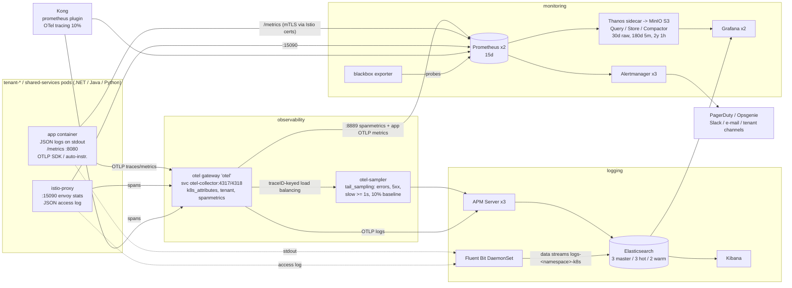

# Observability platform

Metrics, logs, traces, dashboards, alerts and synthetic monitoring for the MicroK8s platform
(~1,000,000 users, ~15k RPS peak, multi-tenant). Everything here is deployed by Argo CD
(project `observability`) and follows [`docs/conventions.md`](../../../docs/conventions.md).

| Component dir | Argo CD app | Namespace | Wave | What |
|---|---|---|---|---|
| `eck-operator/` | `eck-operator` | `elastic-system` | -10 | ECK operator + CRDs (chart `eck-operator` 3.5.0) |
| `opentelemetry-operator/` | `opentelemetry-operator` | `observability` | -10 | OTel operator + CRDs (chart 0.123.1, collector 0.159.0) |
| `kube-prometheus-stack/` | `kube-prometheus-stack` | `monitoring` | 5 | Prometheus HA + Thanos sidecar, Alertmanager HA, Grafana HA, node-exporter, kube-state-metrics, Istio scrape config |
| `thanos/` | `thanos` | `monitoring` | 5 | Query, Query Frontend, Store Gateway, Compactor (plain manifests) |
| `elastic/` | `elastic` | `logging` | 5 | Elasticsearch `elasticsearch`, Kibana `kibana`, APM Server `apm-server`, ILM/templates/SLM bootstrap, ES exporter |
| `fluent-bit/` | `fluent-bit` | `logging` | 5 | DaemonSet log shipper (every node) |
| `opentelemetry/` | `opentelemetry` | `observability` | 5 | Collectors `otel` (gateway) + `otel-sampler` (tail sampling), `platform-instrumentation` |
| `kiali/` | `kiali` | `istio-system` | 5 | Kiali operator + Kiali CR |
| `dashboards/` | `observability-dashboards` | `monitoring` | 5 | Grafana dashboards (ConfigMaps `grafana_dashboard: "1"`) |
| `alerts/` | `observability-alerts` | `monitoring` | 5 | SLO recording + burn-rate alerts, platform / edge / observability alerts |
| `blackbox-exporter/` | `blackbox-exporter` | `monitoring` | 5 | Synthetic probes (`Probe` CRs) |

Well-known endpoints (contract): `otel-collector.observability.svc.cluster.local:4317/4318`,
`elasticsearch-es-http.logging.svc.cluster.local:9200`, `apm-server-apm-http.logging.svc.cluster.local:8200`,
`kube-prometheus-stack-prometheus.monitoring.svc.cluster.local:9090`. Additional:
`thanos-query-frontend.monitoring:9090` (long-range PromQL), `kibana-kb-http.logging:5601`,
UIs `grafana|kibana|kiali.ops.example.local` (Istio internal gateway only).

## Data flow



ASCII summary:

```
 app pods ──stdout JSON──► Fluent Bit (every node) ──► ES data stream logs-<ns>-k8s ──► Kibana / Grafana
    │  └─/metrics (8080, Istio mTLS certs)──────────────────────┐
    │                                                          ▼
    ├─OTLP──► otel-collector (gateway, HPA 3..12) ──:8889──► Prometheus x2 ──► Thanos (S3) ──► Grafana
    │            │ spanmetrics (100 % of spans)                   │
    │            └─traceID LB──► otel-sampler (tail) ──► APM Server ──► ES traces-apm* ──► Kibana APM
 istio-proxy ──spans / :15090 stats / JSON access log ──┘         └──► Alertmanager ──► PagerDuty/Slack/mail
 blackbox exporter ── probes api.example.com, app.example.com, *.ops.example.local ──► Prometheus
```

## Metrics

* **Contract:** Prometheus selects every `ServiceMonitor`, `PodMonitor`, `PrometheusRule`, `Probe` and
  `ScrapeConfig` in every namespace (all `*SelectorNilUsesHelmValues: false`, empty selectors).
* **Istio STRICT mTLS:** Prometheus runs a non-intercepting Istio sidecar that only writes the workload
  certificate to `/etc/prom-certs` (standard Istio cert-mount pattern, see `kube-prometheus-stack/values.yaml`).
  **App charts must set `serviceMonitor.istioMtls: true`** (`charts/microservice`, `charts/frontend`) so the
  ServiceMonitor uses `scheme: https` with those certificates. Other ServiceMonitors/PodMonitors of meshed
  workloads can instead set `scrapeClass: istio-mtls`. The `monitoring` namespace is not labelled
  `istio-injection` (neither enabled nor disabled); only the Prometheus pod is injected (pod label).
* Istio telemetry: single owner `kube-prometheus-stack/manifests/istio-monitors.yaml` (envoy `:15090`,
  istiod). Do not add a second envoy PodMonitor (it would double every rate).
* MicroK8s specifics: kube-controller-manager / scheduler / proxy run in `kubelite` and share one metrics
  registry with the apiserver/kubelet, so they are not scraped (duplicates); etcd monitoring is off (dqlite).
* HA: 2 Prometheus replicas (external label `prometheus_replica`), deduplicated by Thanos Query and at
  compaction (vertical compaction, penalty dedup). Grafana datasource **Prometheus** = last 15 days,
  **Thanos** = up to 2 years (auto-downsampling).
* The OTel gateway exposes OTLP metrics and spanmetrics (`traces_span_metrics_calls_total`,
  `traces_span_metrics_duration_milliseconds_bucket`, exemplars with `trace_id`) on `:8889`; both Prometheus
  replicas scrape it (no remote-write, so the HA pair stays identical).

## Logs

* Apps log **JSON on stdout** with `trace_id`, `span_id`, `tenant_id`, `level`, `message` (contract).
* Fluent Bit (DaemonSet, tolerates all taints incl. control-plane) tails `/var/log/containers`, parses CRI,
  re-assembles multi-line stack traces, enriches with pod labels + namespace labels (`kubernetes_namespace`),
  merges the JSON log into top-level fields, parses Istio/Kong access logs (JSON; text fallbacks), and sets:
  * `tenant` = namespace label `platform.example.com/tenant` → pod label → the log's `tenant_id` (pooled
    services, access logs) → `tenant-<x>` namespace name → `platform`;
  * index **`logs-<namespace>`** via `Logstash_Format On` + `Logstash_Prefix_Key` (`$es_index_prefix`) and a
    constant `Logstash_DateFormat k8s` ⇒ data stream **`logs-<namespace>-k8s`** (e.g. `logs-tenant-acme-k8s`).
    Rollover and retention are done by ILM on the data stream, so no date suffix is needed.
* Buffering: filesystem (`/var/lib/fluent-bit` on the host, 8 GiB per node for container logs), `Retry_Limit 10`,
  gzip, `Generate_ID` + `create` (safe retries, no duplicates).
* Credentials: dedicated least-privilege file-realm user `fluent-bit` (Secret `es-user-fluent-bit` from Vault
  via ESO) — the `elastic` superuser secret is not copied anywhere; the ECK CA is mounted from the same namespace.
* MicroK8s host services (`kubelite`, `containerd`, `k8s-dqlite`) go to `logs-node-k8s`.

## Traces / APM

* Sampling: SDKs and Istio/Kong export spans to the gateway (Istio mesh default: 10 % head sampling, parent
  based; Kong `tracing_sampling_rate` 0.1). The gateway computes **spanmetrics on 100 %** of received spans,
  then routes traces by `traceID` to `otel-sampler`, which keeps **all errors, all HTTP 5xx, all traces ≥ 1 s,
  and 10 % of the rest** (tail sampling needs every span of a trace on the same replica, hence the two tiers).
* Kept traces → **Elastic APM Server** (`apm-server-apm-http.logging:8200`, OTLP gRPC, TLS + secret token
  copied from the ECK secret with the ESO `kubernetes` provider) → `traces-apm*`. Kibana → Observability →
  **APM**: service map, transactions, dependencies, errors, latency distribution, trace waterfall.
* OTLP logs sent to the collector also go to APM (`logs-apm.*`), correlated with traces.
* Kiali's tracing tab is disabled (Kiali only integrates Jaeger/Tempo); use Kibana APM.

### How applications are instrumented

| Language | Recommended | Auto-instrumentation opt-in (pod template annotation) |
|---|---|---|
| Java 21 (Spring Boot) | OTel Java agent (the `microservice` chart copies it with an init container when `apm.enabled`) | `instrumentation.opentelemetry.io/inject-java: "observability/platform-instrumentation"` |
| .NET 8 | OTel .NET SDK (`OpenTelemetry.Extensions.Hosting`, ASP.NET Core + HttpClient + SqlClient instrumentation) or zero-code | `instrumentation.opentelemetry.io/inject-dotnet: "observability/platform-instrumentation"` (+ `instrumentation.opentelemetry.io/otel-dotnet-auto-runtime: linux-musl-x64` on Alpine) |
| Python (FastAPI/gunicorn) | `opentelemetry-distro` + `opentelemetry-instrument` | `instrumentation.opentelemetry.io/inject-python: "observability/platform-instrumentation"` |

The chart injects `OTEL_SERVICE_NAME`, `OTEL_EXPORTER_OTLP_ENDPOINT=http://otel-collector.observability.svc.cluster.local:4318`
and `OTEL_RESOURCE_ATTRIBUTES` (`service.version`, `deployment.environment`, `tenant.id`). The `Instrumentation`
CR uses the same endpoint, W3C `tracecontext,baggage`, `parentbased_always_on` (sampling is central) and
`OTEL_LOGS_EXPORTER=none` (logs stay on stdout → Fluent Bit, to avoid double ingestion). Do not combine the
chart's agent init container and the operator injection for the same pod.

The gateway adds Kubernetes metadata (`k8s.namespace.name`, `k8s.pod.name`, deployment, node, labels
`version`, `platform.example.com/language`, namespace label `platform.example.com/tenant` → `tenant.id`) and
defaults `tenant.id=platform`.

## Finding things

| I have… | Where |
|---|---|
| a `trace_id` (from a log line, an error response, `traceparent`) | Kibana → APM → *Traces* search `trace.id : "<id>"`, or open `https://kibana.ops.example.local/app/apm/link-to/trace/<id>`. Grafana: Explore → *Elastic APM Traces* → `trace.id:<id>` |
| a `trace_id`, want the logs | Kibana Discover, data view `logs-*-k8s`: `trace_id : "<id>"` (APM → trace → *Logs* tab does the same) |
| a tenant | Kibana: `tenant : "acme"` on `logs-*-k8s` (or data view `logs-tenant-acme-*` for a dedicated tenant); APM: `labels.tenant_id` / `tenant.id`; Grafana: *Platform Overview & SLOs* → variable *Tenant* |
| a correlation id (`X-Correlation-ID`) | `correlation_id : "<id>"` in Kibana (Kong, Istio access logs and apps log it) |
| a slow endpoint | Grafana *Microservice RED* → "Top operations p95" (exemplar ◆ → trace in APM) |
| a failing canary | *Microservice RED* → "Canary vs stable" row (split by image tag), Argo Rollouts phase |
| circuit breaking | *Circuit Breakers & Retries* dashboard (ejections, overflow `UO`, retries `URX`, `UH`) |

Grafana folders: **Platform** (Platform Overview & SLOs = home dashboard, Kong API Gateway, Fluent Bit),
**Services** (Microservice RED, Circuit Breakers & Retries), **Data** (Data Services Summary), plus the
kube-prometheus-stack default dashboards. Any team can ship dashboards as a ConfigMap labelled
`grafana_dashboard: "1"` in any namespace (annotation `grafana_folder` picks the folder).

## Alerting

* Routing (`kube-prometheus-stack/values.yaml`): `severity=critical` → PagerDuty (switch to receiver
  `oncall-opsgenie` if Opsgenie is used) **and** Slack; `warning` → Slack `#platform-alerts` + e-mail;
  `info` → Slack `#platform-info`; `tenant=<x>` → the tenant's channel as well (tenants may also ship
  `AlertmanagerConfig` CRs labelled `platform.example.com/alertmanager-config: "true"`, auto-scoped to their
  namespace). Watchdog → dead man's switch webhook every minute.
* Inhibition: critical mutes warning/info of the same alert; fast SLO burn mutes slow burn; node down mutes
  everything on that node; ES red mutes yellow; `RedisNoMaster` mutes Redis replication alerts.
* **SLOs** (`alerts/manifests/slo-rules.yaml`) for every mesh service (per namespace + Service, e.g.
  `tenant-acme/orders-v1`): availability 99.9 % (non-5xx) and latency 99 % < 500 ms over 30 days, with
  multi-window multi-burn-rate alerts (14.4×/1h+5m and 6×/6h+30m page; 3×/1d+2h and 1×/3d+6h ticket).
* Alerts owned here: platform (node pressure, PVC filling, Longhorn, certificates, Argo CD, Argo Rollouts),
  edge (Kong 5xx surge / latency, synthetic probes, TLS expiry), observability pipeline (Elasticsearch,
  Fluent Bit, OTel collector, Thanos). **Data-service alerts** (Redis master/replication, CNPG lag/WAL,
  RabbitMQ backlog/alarms, Kafka URP/ISR/consumer lag) are owned next to each data service in
  `gitops/platform/data/*/manifests/*monitoring*.yaml` and are intentionally not duplicated here.
* Every alert has `runbook_url: https://github.com/mahmoud-araby/microk8s-onperm/blob/main/docs/runbooks/<Name>.md`.
  Runbooks referenced: `SLOAvailabilityBudgetBurn`, `SLOLatencyBudgetBurn`, `NodeUnderPressure`,
  `NodeDiskPressureCritical`, `PlatformPVCFillingUp`, `LonghornVolumeDegraded`, `LonghornNodeStorageAlmostFull`,
  `CertificateExpiringSoon`, `ArgoCDAppDegraded`, `ArgoCDAppOutOfSync`, `RolloutAborted`, `Kong5xxSurge`,
  `KongLatencyHigh`, `SyntheticProbeFailed`, `ElasticsearchClusterRed`, `ElasticsearchClusterYellow`,
  `ElasticsearchDiskWatermark`, `ElasticsearchHeapHigh`, `ElasticsearchExporterDown`, `FluentBitOutputErrors`,
  `OTelCollectorDroppingSpans`, `ThanosCompactHalted`, `ThanosSidecarUploadFailing`.

## Synthetic monitoring

`blackbox-exporter/manifests/probes.yaml`: `https://api.example.com/health` (JSON body required) and
`https://app.example.com/` every 30 s through the public VIP (critical), ops UIs `*.ops.example.local`
every 60 s (401/403/redirect = healthy, TLS verified against the internal CA), and in-cluster health of
Grafana, Alertmanager, Prometheus, Thanos, Kibana, Elasticsearch, APM Server and the OTLP ports.

## Retention & sizing (1M users)

Assumptions from [`docs/capacity-planning.md`](../../../docs/capacity-planning.md): 15k RPS peak, ~1.5 TB/day
raw logs at INFO, 10 % trace baseline + errors/slow.

| Data | Retention | Volume estimate | Where |
|---|---|---|---|
| Container logs | hot 0–7 d (rollover 1 d / 50 GB primary shard), warm 7–30 d, delete 30 d | 1.5 TB/day raw ≈ 1.05 TB/day on disk ×2 (replica) on hot = **~15 TB hot**; warm (force-merged, `best_compression`, 0 replicas – immutable and snapshotted) 23 d × ~0.75 TB = **~17 TB** | ES hot 3 × 6 TiB, warm 2 × 12 TiB |
| APM traces | 7 d (warm after 2 d) | ~90k spans/s received, ~11k/s kept × ~1 KB ≈ 0.9 TB/day raw → **~2 TB hot + ~2.5 TB warm** | `traces-apm*` |
| APM errors / OTLP logs | 30 d | small | `logs-apm.*` |
| APM metrics | 90 d | small | `metrics-apm.*` |
| Prometheus | 15 d local | ~3–5 M active series/replica, ~130k samples/s ⇒ ~17 GB/day ⇒ ~260 GB + WAL | 2 × 500 GiB `longhorn-db` |
| Thanos (S3/MinIO) | raw 30 d, 5 m 180 d, 1 h 2 y | ~0.5 TB raw + ~0.3 TB 5 m + ~0.2 TB 1 h ≈ **1–1.5 TB** | bucket `thanos-metrics` |
| ES snapshots | 35 d (SLM nightly 01:30, min 7 / max 60) | incremental, ≈ size of the cluster | bucket `es-snapshots` |

Total Elasticsearch ≈ 37 TB used of ~42 TiB provisioned (matches the ~45 TB in the capacity plan).
**The `observability` pool as listed in the capacity plan (5 × 4 TB NVMe) cannot hold this:** hot nodes need
≥ 6 TB NVMe each and warm nodes ≥ 12 TB (SATA SSD/HDD is fine for warm). Either add dedicated ES nodes to the
pool (recommended: 3 hot + 2 warm + the 5 existing nodes for Prometheus/Thanos/Kibana/APM/collectors), reduce
log volume (Istio access-log filter `response.code >= 400 || response.duration > 1000` in
`core/istio` Telemetry cuts ~60 %), or shorten hot retention. Add a 4th hot node when hot disk passes 75 %.
Shard count stays bounded: 1 primary per data stream backing index (a namespace rolls over more often only
when it is big), ≈ 3,000 shards total for ~80 namespaces.

Compute requests (steady state): Prometheus 2 × 4 CPU / 24–40 GiB, ES hot 3 × 6 CPU / 32 GiB (16 GiB heap),
warm 2 × 2 CPU / 24 GiB (12 GiB heap), masters 3 × 1 CPU / 8 GiB (4 GiB heap), APM 3 × 1 CPU / 2–4 GiB,
Kibana 2 × 0.5 CPU / 2–3 GiB, OTel gateway 3–12 × 1 CPU / 2–4 GiB, sampler 3 × 1 CPU / 6–8 GiB,
Thanos store 2 × 1 CPU / 6–12 GiB, compactor 1 CPU / 4–10 GiB, Fluent Bit 0.1 CPU / 128–512 MiB per node.

## Secrets (Vault KV v2 `secret/`, ClusterSecretStore `vault-backend`)

| Vault path | Keys | Used by |
|---|---|---|
| `platform/grafana` | `admin-user`, `admin-password`, `db-user`, `db-password`, `secret-key`, `oidc-client-secret` | Grafana (DB = CNPG `pg-main`, database/role `grafana` must exist) |
| `platform/elastic` | `fluent-bit-password`, `grafana-password`, `exporter-password` | ES file-realm users + clients |
| `platform/elastic-snapshots` | `access-key`, `secret-key` | ES keystore (S3 snapshot repo) |
| `platform/thanos` | `access-key`, `secret-key` | `thanos-objstore` (sidecar, store, compactor) |
| `platform/alertmanager` | `pagerduty-routing-key`, `opsgenie-api-key`, `slack-webhook-url`, `smtp-password`, `deadmans-switch-url` | Alertmanager receivers |
| `platform/kiali` | `oidc-client-secret`, `grafana-token` | Kiali |
| `platform/pki` | `ca.crt` | blackbox exporter (verifies `*.ops.example.local`) |

ECK-generated secrets that consumers in other namespaces need (`elasticsearch-es-http-certs-public`,
`apm-server-apm-http-certs-public`, `apm-server-apm-token`) are copied by ESO `SecretStore`s of the
`kubernetes` provider (`logging-namespace` in `monitoring` and `observability`), restricted by a Role in
`logging` to exactly those secret names.

## Prerequisites / integration notes

* Nodes: `vm.max_map_count >= 1048576` on observability nodes (Elasticsearch); `topology.kubernetes.io/zone`
  labels for ES zone awareness; persistent journald (`/var/log/journal`) for host logs.
* Istio: `proxyStatsMatcher` inclusions for outlier detection / retries / overflow (set in `core/istiod`).
* DNS: `*.ops.example.local` must resolve in-cluster (CoreDNS forward) for the ops-UI probes and for Kiali's
  OIDC discovery; Kiali also needs the internal CA in ConfigMap `kiali-cabundle` (`openid-server-ca.crt`).
* Kibana SSO: Elasticsearch OIDC realm requires a Platinum/Enterprise license — see `elastic/manifests/kibana.yaml`.
* AppProject `observability` must allow destinations `monitoring`, `logging`, `elastic-system`,
  `observability`, `istio-system` and cluster-scoped resources (CRDs, ClusterRoles, webhooks).
* Placeholders to replace: MinIO endpoint `minio.storage.example.local:9000` (Thanos, ES snapshots),
  SMTP host, Slack channels, tenant receivers (`tenant-acme`, `tenant-globex`), cluster label `microk8s-prod`.
